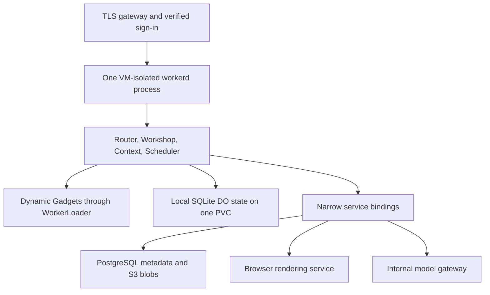

# Self-hosting Aether

## What runs today

There are four separate execution paths. Their configuration is deliberately explicit:

| Mode | Command | State | What it provides |
| --- | --- | --- | --- |
| Native workspace | `npm run workspace:start --prefix runtime` | Local KV/R2 protocol Workers and SQLite DOs | UI, password accounts, workspace management, Context/Scheduler provisioning |
| Upstream local development | `pnpm run-local` | Upstream Wrangler development storage | Full Cloudflare OS workspace for evaluation |
| Standalone foundation | `npm start --prefix runtime` | SQLite files under `AETHER_STATE_DIR` | Real workerd service bindings, native WorkerLoader, and persistent DO probe |
| Cloudflare hosted | `pnpm check` / `pnpm deploy` | Cloudflare-managed services | Original starter deployment |

The local launcher passes arguments to the pinned upstream `scripts/run-local.ts`, including `--port 9000`. It uses upstream development authentication; create an account called `admin` for administrator access. It does not consume `deployment.jsonc` or translate Cloudflare Access into OIDC. Preserve upstream development storage if you need evaluation data, but do not treat it as the eventual production storage format.

The diagnostic foundation intentionally has no model keys, S3 credentials, sign-in implementation, or dynamic user-code endpoint. The separate [native workspace](standalone-workspace.md) hosts the upstream graph and password authentication, using local storage protocol Workers; it supports user-provided [S3](s3-storage.md), [PostgreSQL KV](postgres-storage.md), and a [scoped model gateway](model-gateway.md). Browser rendering and OIDC remain unimplemented. Its probes verify primitives we need for the port. They are not an agent API. The readiness probe performs a read through a service binding into the SQLite-backed Durable Object; liveness checks only the gateway so a storage outage does not trigger continuous liveness restarts.

## Target architecture

The core Worker graph and local state now run. S3 blobs, PostgreSQL KV, and scoped model transport are available. External identity, R2 metadata migration, and browser rendering below remain planned:

Keep the core Workers and Gatekeepers in the same workerd process initially. In-process service bindings preserve the Workers RPC and capability semantics used upstream. Independent Kubernetes Deployments connected by plain HTTP do not automatically preserve those semantics.

Standalone workerd's `localDisk` Durable Object storage is experimental and local to one runtime. Kubernetes does not supply distributed object ownership. One replica can be rescheduled with its disk; it has downtime during restarts and volume reattachment. Additional replicas would create independent object owners and divergent data. Do not horizontally scale the StatefulSet or share its SQLite directory between active processes.

References: [workerd configuration schema](https://github.com/cloudflare/workerd/blob/main/src/workerd/server/workerd.capnp), [workerd security model](https://github.com/cloudflare/workerd#security), and [Cloudflare OS self-hosting status](https://github.com/cloudflare/cloudflare-os#self-hosting).

## Pinned upstream inventory

Aether maintains its Cloudflare OS fork directly under `cloudflare-os/`, initially imported from `4358072f8cb1bc9ddfb6ee11122e194c76cd71e0`. See [source provenance](../cloudflare-os/UPSTREAM.md). The checked-in source is authoritative; upstream main changes independently. The relevant files are `packages/*/wrangler.jsonc` and the Workshop's `src/env.d.ts` within that directory.

| Component / binding | Upstream role | Self-hosted work needed |
| --- | --- | --- |
| Router / frontend assets | Public routing and static UI | Build frontend assets and provide matching asset-service semantics |
| Workshop | Agent, Gadget, account and admin backend | Bundle validated code and configure Workers modules and compatibility flags |
| `LOADER` | Dynamic Gadget Workers | Native `workerLoader` binding; tested in the foundation |
| Workshop DOs | `UserDurableObject`, `OverseerDurableObject`, `AdminSettings`, `PendingLogin` | Stable namespace identities and SQLite DO storage |
| Context DOs | `ContextCollectionDurableObject`, `UserLibraryDurableObject`, `LibraryRegistryDurableObject`, `ContextGatekeeper` | Register exports and stable namespaces in the same graph |
| Scheduler DOs | `ScheduleDriver`, `SchedulerGatekeeper` | Persistent state, alarm delivery and restart tests |
| `BLUEPRINTS`, `AVATARS`, `CONTEXT_COLLECTIONS` | KV namespaces | Implement the used KV API semantics over metadata storage |
| `BLUEPRINT_CONTENT` | R2 objects | Implement the used R2 object semantics over S3, such as Ceph RGW |
| `BROWSER` | Gadget export / screenshot rendering | Separate browser service and an upstream-compatible integration |
| Model providers | Agent inference | Internal gateway with explicitly scoped endpoint access |
| Gatekeeper service bindings | Scoped capabilities and approval workflows | Preserve entrypoints and RPC; add integrations incrementally |
| Authentication | Password accounts, Cloudflare Access or auth Gatekeepers | Implement and test an Authentik integration for self-hosting |

`kvNamespace` and `r2Bucket` in workerd configuration are service designators. They do not directly connect PostgreSQL or S3 and do not provision storage. Either implement the workerd storage protocol or introduce upstream storage interfaces and adapters with equivalent behavior. Before choosing, inventory the actual calls: streaming reads/writes, metadata, pagination, expiration, conditional writes, and object content headers. Do not replace an R2 binding with a generic S3 URL and assume API compatibility.

Native Gadget definitions should retain upstream's `globalOutbound: null`, empty ambient bindings, and explicit capability grants. Kubernetes NetworkPolicy constrains the whole pod, not individual V8 isolates. Allowing egress for a trusted model gateway does not authorize Gadgets to use it.

## Milestones and acceptance criteria

1. **Runtime foundation (this change).** Launch workerd without Wrangler or Cloudflare credentials. Verify service routing, fixed dynamic code loading with no ambient network, concurrent SQLite writes and restart persistence. Build a non-root image and render both Kubernetes overlays.
2. **Core Worker graph (implemented for local evaluation).** Build the pinned frontend and validated Worker modules. Bring up Router, Workshop, Context and Scheduler in one workerd configuration. Introduce complete namespace bindings, modules, assets and compatibility settings. Fail config generation on unsupported required bindings; never silently omit them.
The graph is bundled from the pinned upstream configs; build-time Miniflare KV/R2 Workers supply persistent local protocol services. HTTP/WebSocket authentication, account isolation, workspace/admin state, Gatekeeper provisioning, KV avatars and bundled R2 Blueprints pass native restart tests. Scheduled callback delivery and model-driven Gadget creation still need acceptance tests.

3. **Self-hosted persistence.** Implement metadata and blob adapters. Use real PostgreSQL and S3-compatible services for contract tests, including binary and streaming round trips, list pagination, expiration and failure behavior. Verify create/reopen/delete of a Blueprint, avatar and Context collection from the UI after restart.
4. **Identity and models.** Scoped internal model access is implemented. Add an Authentik auth Gatekeeper or verified OIDC adapter. Verify issuer, audience, signature, expiry, session revocation and subject mapping. Derive identity from verified tokens or an authenticated internal channel; do not trust arbitrary forwarded identity headers. Test account isolation and approved resource grants.
5. **Browser and integrations.** Implement browser rendering, then port a custom Gatekeeper followed by GitHub. Verify Gadget creation, human approval and denial, screenshot/PDF export, scheduled work after restart, and cross-account isolation.
6. **Operational pilot.** Exercise CSI rescheduling, volume permissions, stopped-runtime backup and restore, upgrades with unchanged namespace identities, capacity limits, and credential rotation. Validate VM isolation before accepting generated user code. Horizontal scaling needs a separate ownership/fencing/routing design.

## Isolation and operations

workerd is not itself a hardened boundary for hostile generated code. The base manifest runs only bundled diagnostic code. Before introducing user-generated Gadgets, use the Kata overlay or another reviewed VM-backed runtime. A single Kata VM contains the entire process, including trusted Workers; it is not a separate VM per Gadget or tenant. Isolate tenants in separate runtime pods/VMs if the trust model requires a boundary outside V8.

DO namespace `uniqueKey` values are permanent storage identities. Back up the configuration, namespace identities, pinned runtime version and entire state directory together. For this initial version, stop workerd before copying SQLite files, including WAL/SHM files. A live file copy is not a consistent backup. Test restore with the same pinned image before upgrading. The PVC persists across a normal StatefulSet restart; do not delete the namespace or PVC as an upgrade procedure.

The pinned runtime dependency is in `runtime/package-lock.json`. The upstream pnpm dependency graph remains separate so the runtime can be built without installing the frontend and managed-platform tooling. For disconnected deployment, mirror all locked npm packages and base images through your connected build pipeline, build the runtime image there, then transfer it to the internal OCI registry. Runtime startup downloads nothing. Full local-development mode installs packages at startup and is therefore not the disconnected production path.

Kubernetes reports process availability, not end-to-end agent correctness. The foundation's CI does not establish a complete production Cloudflare OS port; each milestone above has its own acceptance tests.
